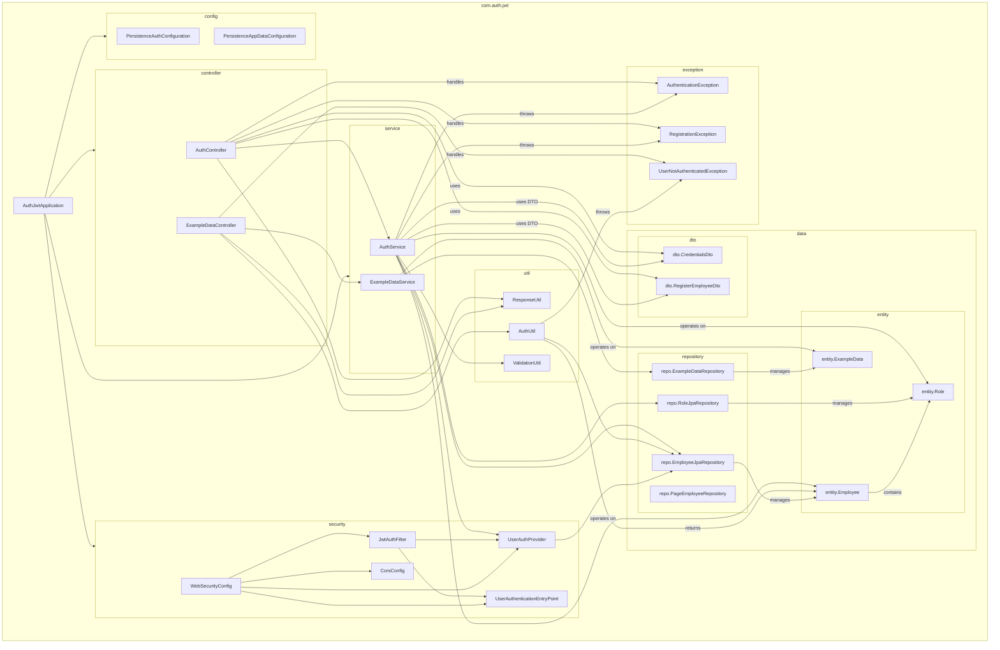

```mermaid
graph TD
    subgraph com.auth.jwt
        direction LR

        subgraph controller
            AuthController[AuthController]
            ExampleDataController[ExampleDataController]
        end

        subgraph service
            AuthService[AuthService]
            ExampleDataService[ExampleDataService]
        end

        subgraph data
            direction LR
            subgraph dto
                CredentialsDto[dto.CredentialsDto]
                RegisterEmployeeDto[dto.RegisterEmployeeDto]
            end
            subgraph entity
                Employee[entity.Employee]
                Role[entity.Role]
                ExampleData[entity.ExampleData]
            end
            subgraph repository
                EmployeeJpaRepository[repo.EmployeeJpaRepository]
                RoleJpaRepository[repo.RoleJpaRepository]
                ExampleDataRepository[repo.ExampleDataRepository]
                PageEmployeeRepository[repo.PageEmployeeRepository]
            end
        end

        subgraph security
            JwtAuthFilter[JwtAuthFilter]
            UserAuthProvider[UserAuthProvider]
            WebSecurityConfig[WebSecurityConfig]
            UserAuthenticationEntryPoint[UserAuthenticationEntryPoint]
            CorsConfig[CorsConfig]
        end

        subgraph util
            AuthUtil[AuthUtil]
            ResponseUtil[ResponseUtil]
            ValidationUtil[ValidationUtil]
        end

        subgraph exception
            AuthenticationException[AuthenticationException]
            RegistrationException[RegistrationException]
            UserNotAuthenticatedException[UserNotAuthenticatedException]
        end

        subgraph config
            PersistenceAuthConfiguration[PersistenceAuthConfiguration]
            PersistenceAppDataConfiguration[PersistenceAppDataConfiguration]
        end

        AuthJwtApplication[AuthJwtApplication]
    end

    %% Dependencies
    AuthController --> AuthService
    AuthController --> ResponseUtil
    AuthController -- uses --> CredentialsDto
    AuthController -- uses --> RegisterEmployeeDto
    AuthController -- handles --> AuthenticationException
    AuthController -- handles --> RegistrationException

    ExampleDataController --> ExampleDataService
    ExampleDataController --> AuthUtil
    ExampleDataController --> ResponseUtil
    ExampleDataController -- handles --> UserNotAuthenticatedException

    AuthService --> EmployeeJpaRepository
    AuthService --> RoleJpaRepository
    AuthService --> UserAuthProvider
    AuthService --> ValidationUtil
    AuthService -- uses DTO --> RegisterEmployeeDto
    AuthService -- uses DTO --> CredentialsDto
    AuthService -- operates on --> Employee
    AuthService -- operates on --> Role
    AuthService -- throws --> AuthenticationException
    AuthService -- throws --> RegistrationException

    ExampleDataService --> ExampleDataRepository
    ExampleDataService -- operates on --> ExampleData

    AuthUtil --> EmployeeJpaRepository
    AuthUtil -- returns --> Employee
    AuthUtil -- throws --> UserNotAuthenticatedException

    JwtAuthFilter --> UserAuthProvider
    JwtAuthFilter --> UserAuthenticationEntryPoint

    UserAuthProvider --> EmployeeJpaRepository

    WebSecurityConfig --> UserAuthProvider
    WebSecurityConfig --> UserAuthenticationEntryPoint
    WebSecurityConfig --> JwtAuthFilter
    WebSecurityConfig --> CorsConfig

    AuthJwtApplication --> config
    AuthJwtApplication --> controller
    AuthJwtApplication --> service
    AuthJwtApplication --> security

    %% Data Layer Dependencies
    EmployeeJpaRepository -- manages --> Employee
    RoleJpaRepository -- manages --> Role
    ExampleDataRepository -- manages --> ExampleData
    Employee -- contains --> Role
```
