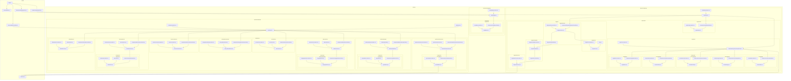

```mermaid
graph TD
    subgraph Global
        direction LR
        App_jsx["App.jsx"] --> ProtectedRoute_js["ProtectedRoute.js"]
        App_jsx --> LandingPage_idx["features/LandingPage/index.js"]
        App_jsx --> LoginPage_idx["features/LoginPage/index.js"]
        App_jsx --> Dashboard_idx["features/Dashboard/index.js"]
        Utils_axios["utils/axios.js"]
    end

    subgraph features
        direction TB

        subgraph LandingPage ["features/LandingPage"]
            direction LR
            LandingPage_idx --> LandingPage_jsx["LandingPage.jsx"]
            LandingPage_css["LandingPage.module.css"] --> LandingPage_jsx
            LandingPage_jsx --> LandingPage_LoginButton_idx["components/LoginButton/index.js"]
            subgraph LandingPage_components ["components"]
                direction LR
                subgraph LandingPage_LoginButton ["LoginButton"]
                    LandingPage_LoginButton_idx --> LandingPage_LoginButton_jsx["LoginButton.jsx"]
                    LandingPage_LoginButton_css["LoginButton.module.css"] --> LandingPage_LoginButton_jsx
                end
            end
        end

        subgraph LoginPage ["features/LoginPage"]
            direction TB
            LoginPage_idx --> LoginPage_jsx["LoginPage.jsx"]
            LoginPage_css["LoginPage.module.css"] --> LoginPage_jsx
            LoginPage_jsx --> LoginPage_LoginHeader_idx["components/LoginHeader/index.js"]
            LoginPage_jsx --> LoginPage_LoginForm_jsx["components/LoginForm/LoginForm.jsx"]
            LoginPage_jsx --> LoginPage_Register_RegisterSection_idx["components/Register/RegisterSection/index.js"]
            subgraph LoginPage_components ["components"]
                direction TB
                subgraph LoginPage_LoginHeader ["LoginHeader"]
                    direction LR
                    LoginPage_LoginHeader_idx --> LoginPage_LoginHeader_jsx["LoginHeader.jsx"]
                    LoginPage_LoginHeader_css["LoginHeader.module.css"] --> LoginPage_LoginHeader_jsx
                end
                subgraph LoginPage_LoginForm ["LoginForm"]
                    direction TB
                    LoginPage_LoginForm_jsx --> LoginPage_LoginForm_FormHeader_idx["components/FormHeader/index.js"]
                    LoginPage_LoginForm_jsx --> LoginPage_LoginForm_ErrorMessage_idx["components/ErrorMessage/index.js"]
                    LoginPage_LoginForm_jsx --> LoginPage_LoginForm_UsernameField_idx["components/UsernameField/index.js"]
                    LoginPage_LoginForm_jsx --> LoginPage_LoginForm_PasswordField_idx["components/PasswordField/index.js"]
                    LoginPage_LoginForm_jsx --> LoginPage_LoginForm_LoginButton_idx["components/LoginButton/index.js"]
                    LoginPage_LoginForm_css["LoginForm.module.css"] --> LoginPage_LoginForm_jsx
                    LoginPage_LoginForm_jsx --> Utils_axios
                    subgraph LoginPage_LoginForm_components ["components"]
                        direction TB
                        subgraph LoginPage_LoginForm_FormHeader ["FormHeader"]
                            direction LR
                            LoginPage_LoginForm_FormHeader_idx --> LoginPage_LoginForm_FormHeader_jsx["FormHeader.jsx"]
                            LoginPage_LoginForm_FormHeader_css["FormHeader.module.css"] --> LoginPage_LoginForm_FormHeader_jsx
                        end
                        subgraph LoginPage_LoginForm_ErrorMessage ["ErrorMessage"]
                            direction LR
                            LoginPage_LoginForm_ErrorMessage_idx --> LoginPage_LoginForm_ErrorMessage_jsx["ErrorMessage.jsx"]
                            LoginPage_LoginForm_ErrorMessage_css["ErrorMessage.module.css"] --> LoginPage_LoginForm_ErrorMessage_jsx
                        end
                        subgraph LoginPage_LoginForm_UsernameField ["UsernameField"]
                            direction LR
                            LoginPage_LoginForm_UsernameField_idx --> LoginPage_LoginForm_UsernameField_jsx["UsernameField.jsx"]
                            LoginPage_LoginForm_UsernameField_css["UsernameField.module.css"] --> LoginPage_LoginForm_UsernameField_jsx
                        end
                        subgraph LoginPage_LoginForm_PasswordField ["PasswordField"]
                            direction LR
                            LoginPage_LoginForm_PasswordField_idx --> LoginPage_LoginForm_PasswordField_jsx["PasswordField.jsx"]
                            LoginPage_LoginForm_PasswordField_css["PasswordField.module.css"] --> LoginPage_LoginForm_PasswordField_jsx
                        end
                        subgraph LoginPage_LoginForm_LoginButton ["LoginButton"]
                            direction LR
                            LoginPage_LoginForm_LoginButton_idx --> LoginPage_LoginForm_LoginButton_jsx["LoginButton.jsx"]
                            LoginPage_LoginForm_LoginButton_css["LoginButton.module.css"] --> LoginPage_LoginForm_LoginButton_jsx
                        end
                    end
                end
                subgraph LoginPage_Register ["Register"]
                    direction TB
                    subgraph LoginPage_Register_RegisterLink ["RegisterLink"]
                        direction LR
                        LoginPage_Register_RegisterLink_idx["index.js"] --> LoginPage_Register_RegisterLink_jsx["RegisterLink.jsx"]
                        LoginPage_Register_RegisterLink_css["RegisterLink.module.css"] --> LoginPage_Register_RegisterLink_jsx
                    end
                    subgraph LoginPage_Register_RegisterSection ["RegisterSection"]
                        direction LR
                        LoginPage_Register_RegisterSection_idx --> LoginPage_Register_RegisterSection_jsx["RegisterSection.jsx"]
                        LoginPage_Register_RegisterSection_css["RegisterSection.module.css"] --> LoginPage_Register_RegisterSection_jsx
                        LoginPage_Register_RegisterSection_jsx --> LoginPage_Register_RegisterLink_idx
                        LoginPage_Register_RegisterSection_jsx --> LoginPage_Register_RegistrationModal_idx["RegistrationModal/index.js"]
                    end
                    subgraph LoginPage_Register_RegistrationModal ["RegistrationModal"]
                        direction LR
                        LoginPage_Register_RegistrationModal_idx --> LoginPage_Register_RegistrationModal_jsx["RegistrationModal.jsx"]
                        LoginPage_Register_RegistrationModal_css["RegistrationModal.module.css"] --> LoginPage_Register_RegistrationModal_jsx
                        LoginPage_Register_RegistrationModal_jsx --> LoginPage_Register_RegistrationForm_idx["RegistrationForm/index.js"]
                    end
                    subgraph LoginPage_Register_RegistrationForm ["RegistrationForm"]
                        direction LR
                        LoginPage_Register_RegistrationForm_idx --> LoginPage_Register_RegistrationForm_jsx["RegistrationForm.jsx"]
                        LoginPage_Register_RegistrationForm_css["RegistrationForm.module.css"] --> LoginPage_Register_RegistrationForm_jsx
                        LoginPage_Register_RegistrationForm_jsx --> Utils_axios
                    end
                end
            end
        end

        subgraph Dashboard ["features/Dashboard"]
            direction TB
            Dashboard_idx --> Dashboard_jsx["Dashboard.jsx"]
            Dashboard_js["Dashboard.js"] --> Dashboard_jsx
            Dashboard_css["Dashboard.module.css"] --> Dashboard_jsx
            Dashboard_jsx --> Dashboard_ApiAuthorizationSection_idx["components/ApiAuthorizationSection/index.js"]
            Dashboard_jsx --> Dashboard_AxiosSection_idx["components/AxiosSection/index.js"]
            Dashboard_jsx --> Dashboard_DashboardHeader_idx["components/DashboardHeader/index.js"]
            Dashboard_jsx --> Dashboard_I18nextSection_idx["components/I18nextSection/index.js"]
            Dashboard_jsx --> Dashboard_LibraryStatusIndicator_idx["components/LibraryStatusIndicator/index.js"]
            Dashboard_jsx --> Dashboard_ReactIconsSection_idx["components/ReactIconsSection/index.js"]
            Dashboard_jsx --> Dashboard_RechartsSection_idx["components/RechartsSection/index.js"]
            Dashboard_jsx --> Dashboard_TailwindSection_idx["components/TailwindSection/index.js"]
            
            subgraph Dashboard_components ["components"]
                direction TB
                subgraph Dashboard_ApiAuthorizationSection ["ApiAuthorizationSection"]
                    direction TB
                    Dashboard_ApiAuthorizationSection_idx --> Dashboard_ApiAuthorizationSection_jsx["ApiAuthorizationSection.jsx"]
                    Dashboard_ApiAuthorizationSection_js["ApiAuthorizationSection.js"] --> Dashboard_ApiAuthorizationSection_jsx
                    Dashboard_ApiAuthorizationSection_css["ApiAuthorizationSection.module.css"] --> Dashboard_ApiAuthorizationSection_jsx
                    Dashboard_ApiAuthorizationSection_jsx --> Dashboard_ApiAuthorizationSection_ApiTestButton_idx["components/ApiTestButton/index.js"]
                    subgraph Dashboard_ApiAuthorizationSection_components ["components"]
                        direction LR
                        subgraph Dashboard_ApiAuthorizationSection_ApiTestButton ["ApiTestButton"]
                            Dashboard_ApiAuthorizationSection_ApiTestButton_idx --> Dashboard_ApiAuthorizationSection_ApiTestButton_jsx["ApiTestButton.jsx"]
                            Dashboard_ApiAuthorizationSection_ApiTestButton_css["ApiTestButton.module.css"] --> Dashboard_ApiAuthorizationSection_ApiTestButton_jsx
                            Dashboard_ApiAuthorizationSection_ApiTestButton_jsx --> Utils_axios
                        end
                    end
                end
                subgraph Dashboard_AxiosSection ["AxiosSection"]
                    direction LR
                    Dashboard_AxiosSection_idx --> Dashboard_AxiosSection_jsx["AxiosSection.jsx"]
                    Dashboard_AxiosSection_js["AxiosSection.js"] --> Dashboard_AxiosSection_jsx
                    Dashboard_AxiosSection_css["AxiosSection.module.css"] --> Dashboard_AxiosSection_jsx
                end
                subgraph Dashboard_DashboardHeader ["DashboardHeader"]
                    direction TB
                    Dashboard_DashboardHeader_idx --> Dashboard_DashboardHeader_jsx["DashboardHeader.jsx"]
                    Dashboard_DashboardHeader_js["DashboardHeader.js"] --> Dashboard_DashboardHeader_jsx
                    Dashboard_DashboardHeader_css["DashboardHeader.module.css"] --> Dashboard_DashboardHeader_jsx
                    Dashboard_DashboardHeader_jsx --> Dashboard_DashboardHeader_LogoutButton_idx["components/LogoutButton/index.js"]
                    subgraph Dashboard_DashboardHeader_components ["components"]
                        direction LR
                        subgraph Dashboard_DashboardHeader_LogoutButton ["LogoutButton"]
                            Dashboard_DashboardHeader_LogoutButton_idx --> Dashboard_DashboardHeader_LogoutButton_jsx["LogoutButton.jsx"]
                            Dashboard_DashboardHeader_LogoutButton_js["LogoutButton.js"] --> Dashboard_DashboardHeader_LogoutButton_jsx
                            Dashboard_DashboardHeader_LogoutButton_css["LogoutButton.module.css"] --> Dashboard_DashboardHeader_LogoutButton_jsx
                        end
                    end
                end
                subgraph Dashboard_I18nextSection ["I18nextSection"]
                    direction TB
                    Dashboard_I18nextSection_idx --> Dashboard_I18nextSection_jsx["I18nextSection.jsx"]
                    Dashboard_I18nextSection_js["I18nextSection.js"] --> Dashboard_I18nextSection_jsx
                    Dashboard_I18nextSection_css["I18nextSection.module.css"] --> Dashboard_I18nextSection_jsx
                    Dashboard_I18nextSection_jsx --> Dashboard_I18nextSection_LanguageSwitcher_idx["components/LanguageSwitcher/index.js"]
                    subgraph Dashboard_I18nextSection_components ["components"]
                        direction LR
                        subgraph Dashboard_I18nextSection_LanguageSwitcher ["LanguageSwitcher"]
                            Dashboard_I18nextSection_LanguageSwitcher_idx --> Dashboard_I18nextSection_LanguageSwitcher_jsx["LanguageSwitcher.jsx"]
                            Dashboard_I18nextSection_LanguageSwitcher_js["LanguageSwitcher.js"] --> Dashboard_I18nextSection_LanguageSwitcher_jsx
                            Dashboard_I18nextSection_LanguageSwitcher_css["LanguageSwitcher.module.css"] --> Dashboard_I18nextSection_LanguageSwitcher_jsx
                        end
                    end
                end
                subgraph Dashboard_LibraryStatusIndicator ["LibraryStatusIndicator"]
                    direction LR
                    Dashboard_LibraryStatusIndicator_idx --> Dashboard_LibraryStatusIndicator_jsx["LibraryStatusIndicator.jsx"]
                    Dashboard_LibraryStatusIndicator_js["LibraryStatusIndicator.js"] --> Dashboard_LibraryStatusIndicator_jsx
                    Dashboard_LibraryStatusIndicator_css["LibraryStatusIndicator.module.css"] --> Dashboard_LibraryStatusIndicator_jsx
                end
                subgraph Dashboard_ReactIconsSection ["ReactIconsSection"]
                    direction LR
                    Dashboard_ReactIconsSection_idx --> Dashboard_ReactIconsSection_jsx["ReactIconsSection.jsx"]
                    Dashboard_ReactIconsSection_js["ReactIconsSection.js"] --> Dashboard_ReactIconsSection_jsx
                    Dashboard_ReactIconsSection_css["ReactIconsSection.module.css"] --> Dashboard_ReactIconsSection_jsx
                end
                subgraph Dashboard_RechartsSection ["RechartsSection"]
                    direction TB
                    Dashboard_RechartsSection_idx --> Dashboard_RechartsSection_jsx["RechartsSection.jsx"]
                    Dashboard_RechartsSection_js["RechartsSection.js"] --> Dashboard_RechartsSection_jsx
                    Dashboard_RechartsSection_css["RechartsSection.module.css"] --> Dashboard_RechartsSection_jsx
                    Dashboard_RechartsSection_jsx --> Dashboard_RechartsSection_StatusChart_idx["components/StatusChart/index.js"]
                    subgraph Dashboard_RechartsSection_components ["components"]
                        direction LR
                        subgraph Dashboard_RechartsSection_StatusChart ["StatusChart"]
                            Dashboard_RechartsSection_StatusChart_idx --> Dashboard_RechartsSection_StatusChart_jsx["StatusChart.jsx"]
                            Dashboard_RechartsSection_StatusChart_js["StatusChart.js"] --> Dashboard_RechartsSection_StatusChart_jsx
                            Dashboard_RechartsSection_StatusChart_css["StatusChart.module.css"] --> Dashboard_RechartsSection_StatusChart_jsx
                        end
                    end
                end
                subgraph Dashboard_TailwindSection ["TailwindSection"]
                    direction LR
                    Dashboard_TailwindSection_idx --> Dashboard_TailwindSection_jsx["TailwindSection.jsx"]
                    Dashboard_TailwindSection_js["TailwindSection.js"] --> Dashboard_TailwindSection_jsx
                    Dashboard_TailwindSection_css["TailwindSection.module.css"] --> Dashboard_TailwindSection_jsx
                end
            end
        end
    end
```

